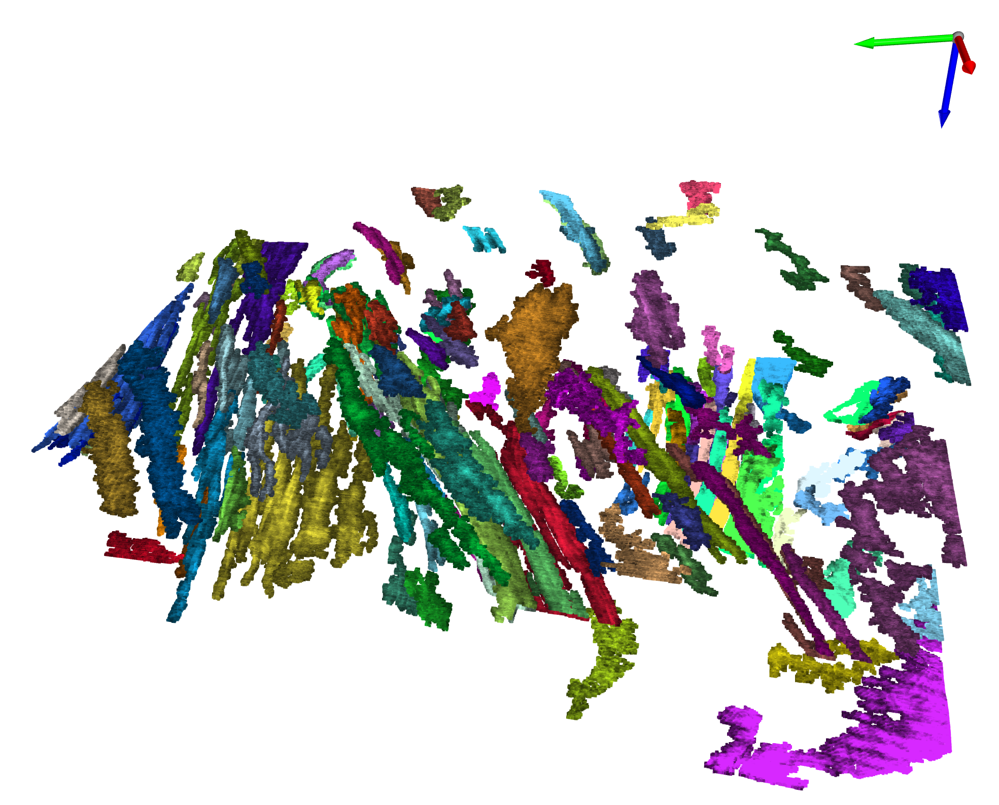

# pyseismic: seismic segmentation and geobody detection in 3D seismic

Workflow to automatically segment 3D seismic reflection data into objects and detect and extract geobodies.

## Usage

For seismic segmentation

```python
import open3d as o3d
from pyntcloud import PyntCloud

from PointCloudSeismicInterpretation import PointCloudSeismicInterpretation

#first load your 3D seismic
#seismic_data is your 3D seismic data loaded as a numpy array

#initiate seismic data object
pointCloudInterpretor = PointCloudSeismicInterpretation(seismic_array=seismic_data)

#extract a point cloud of trace extrema from the seismic
pointCloudInterpretor.extrema_extraction_dask()

#compute semblance attribute and filter points based on a semblance cut-off value
pointCloudInterpretor.filter_point_cloud_with_semblance(kernel=(3,3,9), thr=0.85, in_place=True)

#filter points based on an amplitude cut-off value
pointCloudInterpretor.filter_point_cloud_with_amplitude(thr=0.20, in_place=True)

#create an open3D point cloud object and segment the point cloud with DBSCAN
pcd_pyntcloud = PyntCloud(pd.DataFrame(data={'x':pointCloudInterpretor.point_cloud.T[0], 
                                        'y':pointCloudInterpretor.point_cloud.T[1], 
                                        'z':pointCloudInterpretor.point_cloud.T[2], 
                                        'amplitude':pointCloudInterpretor.amplitude_point_cloud})[:])
pcd_o3d = pcd_pyntcloud.to_instance("open3d", mesh=False)
with o3d.utility.VerbosityContextManager(o3d.utility.VerbosityLevel.Debug) as cm:
    labels = np.array(
        pcd_o3d.cluster_dbscan(eps=2, min_points=8, print_progress=True))
```

For geobody detection in a segmented seismic

```python 
from PointCloudObjectRetrieval import PointCloudObjectRetrieval

#merge seismic point cloud and amplitude point cloud in an numpy array ([n_points, 4])
pcd = np.zeros((len(pointCloudInterpretor.point_cloud),4))
pcd[:,:3] = pointCloudInterpretor.point_cloud[:,:]
pcd[:,3]= pointCloudInterpretor.amplitude_point_cloud
#initiate feature extraction object
FeatureExtractor = PointCloudObjectRetrieval(
    pcd, 
    pointCloudInterpretor.semblance_point_cloud,
    labels
)

#extract features for each point cloud object
standardized_featureDF = FeatureExtractor.get_features(selected_clusters)

#contruct lsh tables
feature_dict = dict(zip(standardized_featureDF.index, standardized_featureDF[selected_features].values))
k = 7 # hash size
L = 20  # number of tables
d = len(selected_features) #2048 # Dimension of Feature vector
lsh = LSHash(hash_size=k, input_dim=d, num_hashtables=L)
for ID, vec in notebook.tqdm(feature_dict.items()):
    lsh.index(vec.flatten(), extra_data=ID)

#query similar geobodies to a specific geobody example previously identified
n_items = 10 #number of similar geobodies
feature_example = feature_dict[0].flatten() #features of the geobody example 
                                            #replace 0 by the id of the identified example
response = lsh_variable.query(feature_example, num_results=n_items, distance_func='hamming')
```

## Notebook demo

For a more complete demo run the the file notebooks/F3dataset-segmentation.ipynb

It gives a complete example of seismic segmentation of the open-source F3-dataset (https://terranubis.com/datainfo/F3-Demo-2020) and geobody detection -specially efficient to retrieve channel geobodies in the seismic-.

#### Point cloud seismic segmentation of F3 seismic data


#### Geobody detection - elongated geobodies - in the F3 seismic data (150-closest objects)

